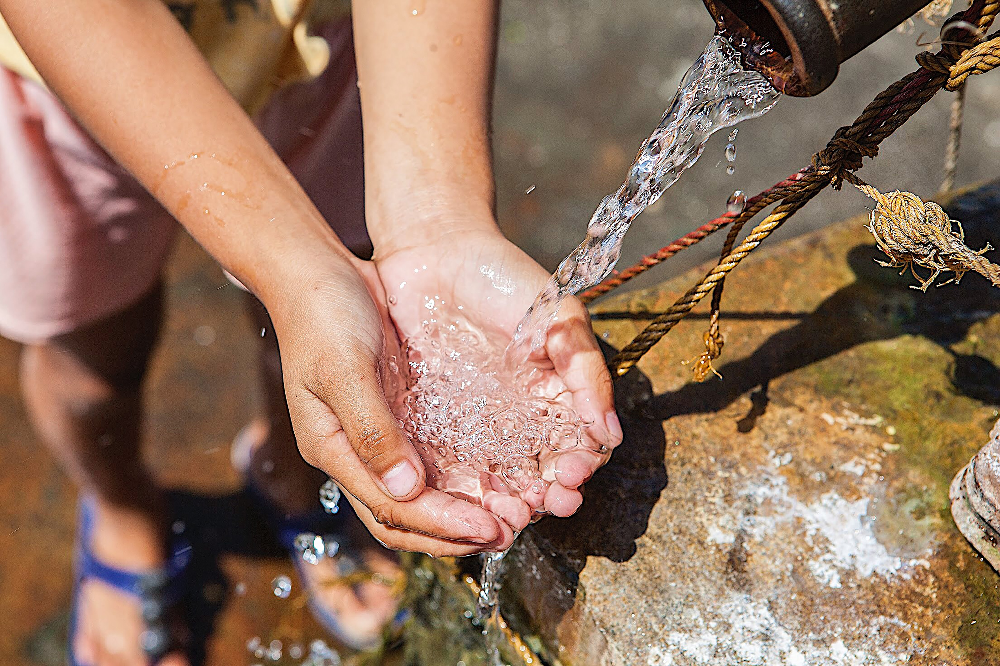

# Tanzanian Water Source Classification 



## Overview

Please, check out the [Notebook](./notebook.ipynb) for an in depth description and review of my work. Here are the [presentation slides](./presentation_slides.pdf). 

According to water.org, of the 59 million people in Tanzania, 16 million of them or 28% of the population do not have easy access to clean water. By looking at data provided by Taarifa and the Tanzanian Ministry of Water, we can see what is working and what is not working to predict whether a given water point will be functional or if it will need repair based on several factors. With this information, we can decide how and where to establish new water points.

## Business and Data Understanding

The intended **stakeholders** are a board of directors for an NGO that is looking for help in figuring out where and how to help with the water crisis in Tanzania. 
The **goal** is to build a classifier in order to make a prediction of the operating condition of a water point in Tanzania for each record in the dataset.
The **implications** of this project could mean several people having access to clean water.

The data comes from Taarifa and the Tanzanian Ministry of Water. The dataset can be found [here.](https://www.drivendata.org/competitions/7/pump-it-up-data-mining-the-water-table/page/23/) 

The original dataset has 3 classes: “Functional”, “Functional Needs Repair”, and “Non Functional”. I engineered it to have 2 classes by combining “Functional Needs Repair” with “Non Functional” to end up with “Functional” and “Needs Repair”.

## Modeling

After cleaning the data, I started with a Dummy Model to have something I could compare my models to. Its accuracy was 55%

I first tried a logistic regression model and tweaked it with some hyperparameters using gridsearch.

Then I used a decision tree classifier which gave me a better score and tried tweaking that with gridsearch, too.

## Evaluation
The tweaked logistic regression model gave me an accuracy score of 73% and a recall score of 61% which is much better than the dummy model. I wanted to use the recall score because it takes into account when the model predicts a water point is functional, when in reality it isn’t. If a water point needs repair, then it has greater consequences to the community which is why looking at instances where the model incorrectly predicts this outcome is important to look at.

The decision tree model gave me the highest accuracy score of 74% and the highest recall score at 69%. 


## Conclusion

The decision tree model gave me the highest accuracy and recall scores and is what I used for my production model. Since I tried a few variations of this model with grid search, I can confidently say this is the best model I tried.

If you have any questions, feel free to email me at jonnie.brown4@gmail.com. 

## Repository Structure
```
├── data.zip
├── notebook.ipynb
├── README.md
├── presentation_slides.pdf
└── water.jpg
```
